# Advanced Lane Detection and Turn Prediction

## 1 Overview
The goal of this project is to use traditional Computer Vision techniques to develop an advanced and robust algorithm that can detect and track lane boundaries in a given image sequence.

This repository contains the code for lane detection and turn prediction for the self-driving cars. The code has been written in Python, using OpenCV library.

Python Code: Project2_LaneDetection.py

The pipeline highlighted below was designed to operate under the following scenarios:

Assumptions:
* It can detect *exactly* two lane lines, i.e. the left and right lane boundaries of the lane the vehicle is currently driving in.
* It cannot detect adjacent lane lines.
* The vehicle must be within a lane and must be aligned along the direction of the lane.
* If only one of two lane lines have been successfully detected, then the detection is considered invalid and will be discarded. 

### 1.2 Dependencies

* Python 3.x
* NumPy
* Matplotlib (for charting and visualising images)
* OpenCV 3.x

## 2 Code pipeline

The camera Calibration matrix and distortion coefficients are already given in the dataset.
#Camera Matrix
```K = [[  1.15422732e+03   0.00000000e+00   6.71627794e+02]```
 ```[  0.00000000e+00   1.14818221e+03   3.86046312e+02]```
 ```[  0.00000000e+00   0.00000000e+00   1.00000000e+00]]```

#Distortion Coefficients
dist = [[ -2.42565104e-01  -4.77893070e-02  -1.31388084e-03  -8.79107779e-05
    2.20573263e-02]]


Following steps are involved in the pipeline, each of which have also been discussed in more detail in the sub-sections below:

* Apply a perspective transform to distorted image ("birds-eye view").
* Apply a distortion correction to warped images.
* Denoising the undistorted image.
* Use color transforms, gradients and filters, to create a thresholded binary image.
* Detect lane pixels and fit a line using polyfitting..
* Determine the curvature of the lane and vehicle position with respect to center.
* Warp the detected lane boundaries back onto the original image.
* Output visual display of the lane boundaries and numerical estimation of lane curvature and vehicle position.


### 2.1 Perspective Transformation & ROI selection

After distortion correction, an undistorted image is operated with Perspective Transformation which warpes the image into a *bird's eye view*. This makes it easier to detect the lane lines (since they are relatively parallel) and measure their curvature.

* Firstly, we compute the transformation matrix by passing the ```src``` and ```dst``` points into ```cv2.getPerspectiveTransform```. These points are determined empirically with the help of the suite of test images.
* Then, the undistorted image is warped by passing it into ```cv2.warpPerspective``` along with the transformation matrix.
* Finally, we cut/crop out the sides of the image using a utility function ```get_roi()``` since this portion of the image contains no relevant information.

Below is an example of warped image:

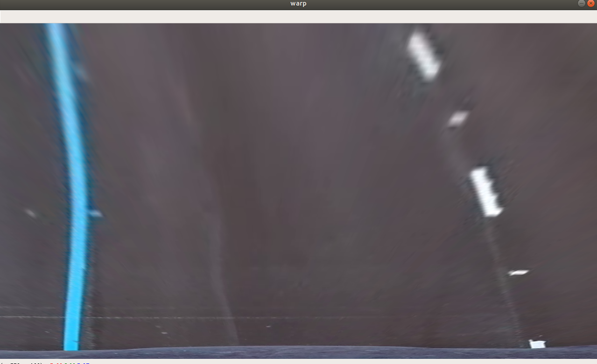 


### 2.2 Distortion correction

Image distortion occurs when a camera looks at 3D objects in the real world and transforms them into a 2D image; this transformation isn’t perfect. Distortion actually changes what the shape and size of these 3D objects appear to be. So, the first step in analyzing camera images, is to undo this distortion so that you can get correct and useful information out of them.


To undistort an image, we need to use calibration matrix and distortion coefficients provided, to pass into OpenCV's ```cv2.undistort()``` function. After this step, we have an undistorted image frame. 

Below is an example of undistorted image:

 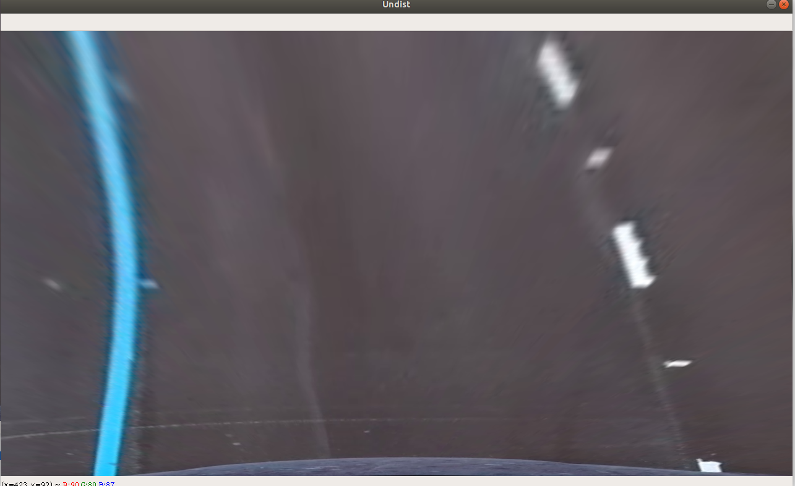

  
### 2.3 Denoising the image
The second most important step in the process pipeline is denoising the image. We have used
median filter to remove salt and pepper noise and have used gaussian filter as well.


### 2.4 Generating a thresholded binary image

This is by far the most involved and challenging step of the pipeline. An overview of the test videos and a review of the [U.S. government specifications for highway curvature](http://onlinemanuals.txdot.gov/txdotmanuals/rdw/horizontal_alignment.htm#BGBHGEGC) revealed the following optical properties of lane lines (on US roads):

* Lane lines have one of two colours, white or yellow
* The surface on *both* sides of the lane lines has different brightness and/or saturation and a different hue than the line itself, and,
* Lane lines are not necessarily contiguous, so the algorithm needs to be able to identify individual line segments as belonging to the same lane line. 


Here, we develop a *filtering process* that takes an undistorted warped image and generates a thresholded binary image that only highlights the pixels likely to be part of the lane lines. Moreover, the thresholding/masking process needs to be robust enough to account for **uneven road surfaces** and most importantly **non-uniform lighting conditions**.

Few techniques mentioned below have been used to detect the lanes:
* Gradient thresholding (Sobel), 
* Thresholding over individual colour channels of different color spaces.

Below is an example of thresholded binary image:

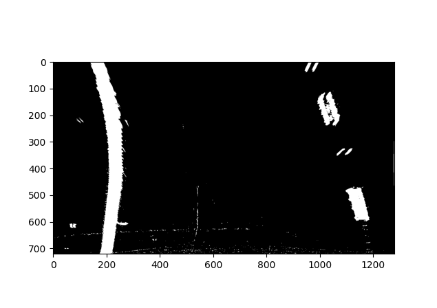


### 2.5 Lane Line detection: Sliding Window technique

We now have a *warped, thresholded binary image* where the pixels are either 0 or 1; 0 (black color) constitutes the unfiltered pixels and 1 (white color) represents the filtered pixels. The next step involves mapping out the lane lines and  determining explicitly which pixels are part of the lines and which belong to the left line and which belong to the right line.

The first technique employed to do so is: **Peaks in Histogram & Sliding Windows**

1. We first take a histogram along all the columns in the lower half of the image. This involves adding up the pixel values along each column in the image. The two most prominent peaks in this histogram will be good indicators of the x-position of the base of the lane lines. These are used as starting points for our search. 

2. From these starting points, we use a sliding window, placed around the line centers, to find and follow the lines up to the top of the frame.

Below is an example of this process visualized for an image: 


### 2.6 Conversion from pixel space to real world space

To report the lane line curvature in meters, we first need to convert from pixel coordinates to real world coordinates. For this, we measure the width of a section of lane that we're projecting in our warped image and the length of a dashed line. 

The values for metres/pixel along the x and y direction are therefore:

```
Average meter per pixel along x-axis: 3.7/720
Average meter per pixel along y-axis: 30.5/720
```

### 2.7 Curvature and Offset

Following this conversion, we can compute the radius of curvature (see tutorial [here](https://www.intmath.com/applications-differentiation/8-radius-curvature.php)) at any point x on the lane line represented by the function ```x = f(y)``` as follows:

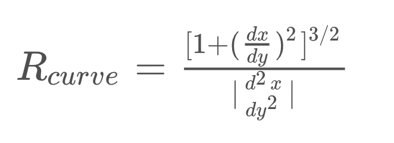

In the case of the second order polynomial above, the first and second derivatives are:

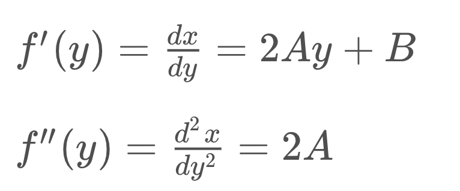

So, our equation for radius of curvature becomes:

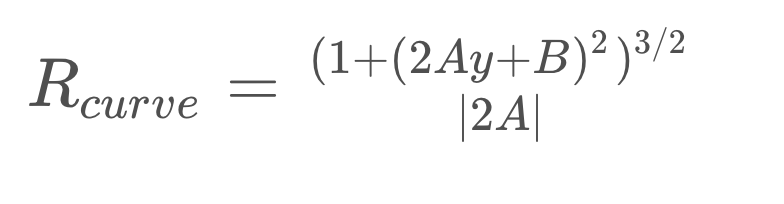

After this process, we can visualize the detected lanes overlayed on the image as shown:


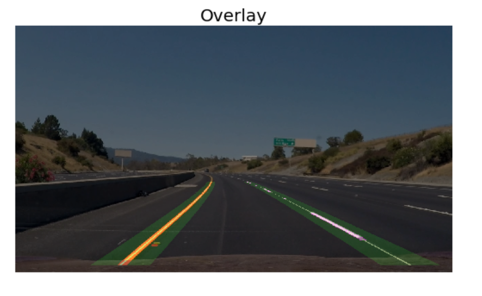


### 2.8 Final output.

After the completion of above mentioned image processing techniques, the final overlayed lane detection lokks as shown in below example images:

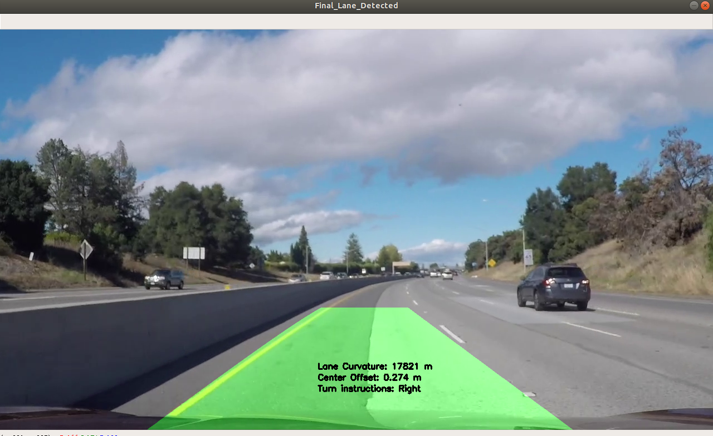   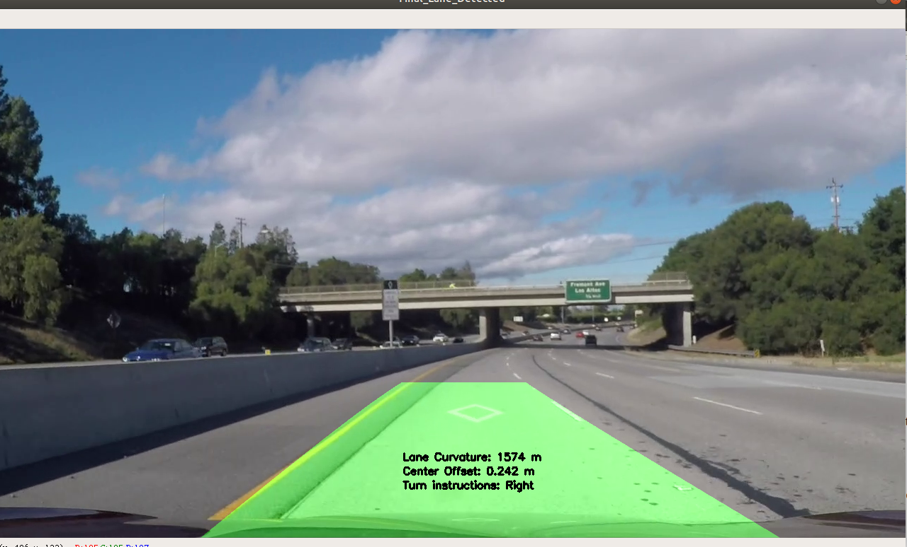

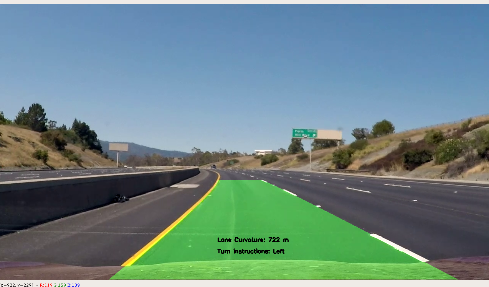   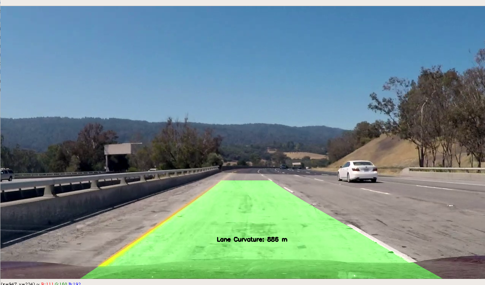

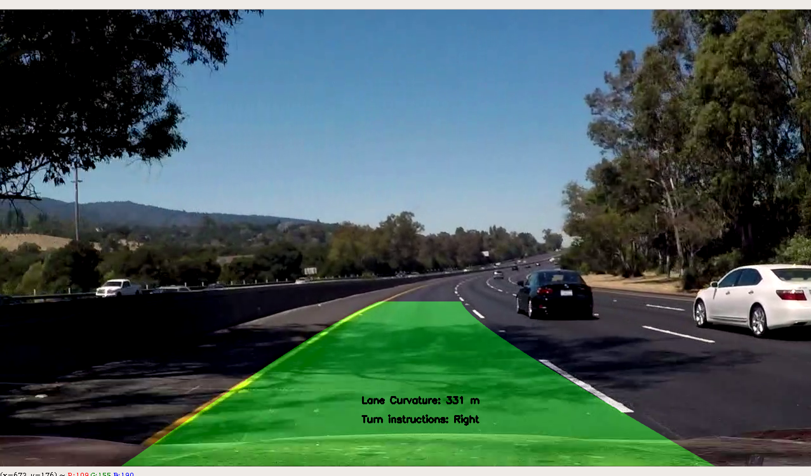   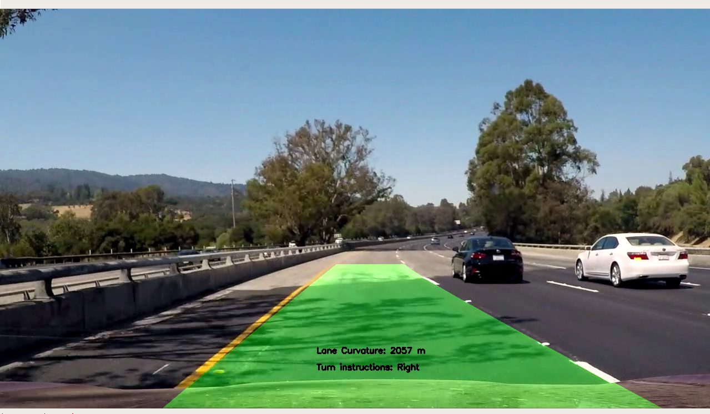


